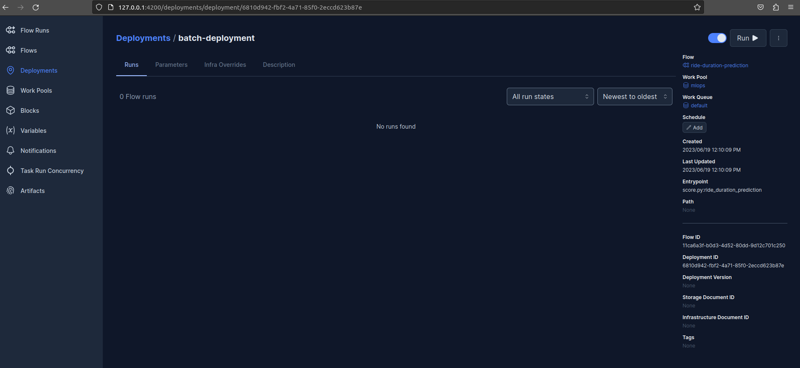
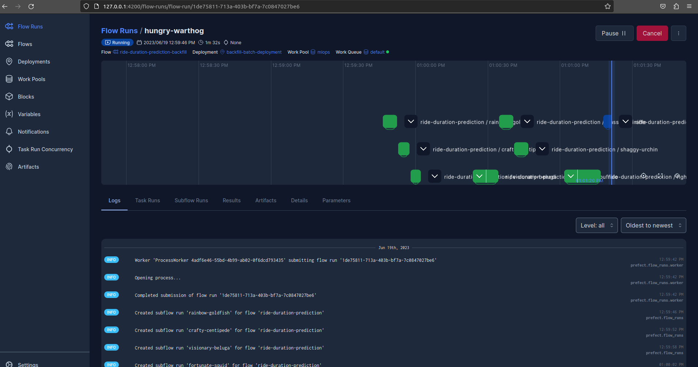

# Notes

The script is gotten from the _.ipynb_ via `jupyter nbconvert --to script score.ipynb`.

The data source paths were updated to ensure data is pulled from the correct location. We also modified the file to push data to a designated S3 bucket. The backfile file was build to run models and the deployment performed via a python script. The following was carried using the old video from DataTalks.

Started by starting a prefect server `prefect server start`

After starting the server , I had to run `prefect agent start ml` to start an agent that could run the process.
Found out that the process failed if for the previous month data. This is because the data is not available.

With _score.py_ working we want to perform a model back fill where we retrouspectively apply the model. In this case we call it _score_backfill.py_.


## Deployment via Prefect Deployment

By first starting a server locally via `prefect server start` and then running `python score.py green 2021 2 1dfce710dc824ecab012f7d910b190f6` we see that the work progresses without an error. We want try to see if we can build a deployment in a subdirectory. At the end it didn't work when it is pulling code from GitHub so I changed it to pull code from local. This is because I am able to add the subdir which is something I am still struggling to figure out when pulling code from GitHub. When you run the next step, don't forget to replace

```yaml
prefect.projects.steps.git_clone_project:
     repository: github/path/to/project.git
```

with

```yaml
- prefect.projects.steps.set_working_directory:
    directory: /home/fini/github-projects/mlops/04-deployment/batch
```

. We run `prefect project init` in the _batch_ folder. Let's see how to register the success run via CLI command. Run by deploying by configuring it and noting the format `scriptname:flow`.

```sh
prefect deploy score.py:ride_duration_prediction --name batch-deployment --description "Bach deployment for prediction model" --pool mlops
```

The following is my output

```txt
╭────────────────────────────────────────────────────────────────────────────────────────────────────────────────────────────────────────────╮
│ Deployment 'ride-duration-prediction/batch-deployment' successfully created with id '6810d942-fbf2-4a71-85f0-2eccd623b87e'.                │
╰─────────────────────────────────────────────────────────────────────────────────────────────────────────────────────────────────────────
View Deployment in UI: http://127.0.0.1:4200/deployments/deployment/6810d942-fbf2-4a71-85f0-2eccd623b87e

To execute flow runs from this deployment, start a worker in a separate terminal that pulls work from the 'mlops' work pool:

        $ prefect worker start --pool 'mlops'

To schedule a run for this deployment, use the following command:

        $ prefect deployment run 'ride-duration-prediction/batch-deployment'
```

Start the worker as specified above in command `prefect worker start --pool 'mlops'` so that it can wait for processes to that are schedulled or those that are run adhoc. Let's do this from the UI. Open the prefect server in the browser, go to deployments and select `batch-deployment/ride-duration-prediction`. You will see  something like this  .

Click on the run button located at the top right. A parge will open asking for params. Populated the parameters with the same data as was done in the CLI run. Watch what happens in the termininal where you ran the worker.

## Batch Run Backfill

The scripte _score_deply.py_ can be used to run the _score.py_ to get predictions. We will deploy this via the CLI with the command 

```sh
prefect deploy score_backfill.py:ride_duration_prediction_backfill --name backfill-batch-deployment --description "Bach deployment for prediction model" --pool mlops
```

You get a similar output as before. Check in the deployment and do a quick run. This time you notice it is not asking for parameters. It runs with the default params. You can watch the log on the us. Here is a picture of what I saw 

So within the CLI we are able to see that as well as see it in the UI. We are able to get more information in the sub task.  We can updated the batch to have more information by just clicking to it anfd editing. We can improved the description, schedule and do more. We can also edit in the _deployment.yaml_. We will explained in a different text with a linked shared here.